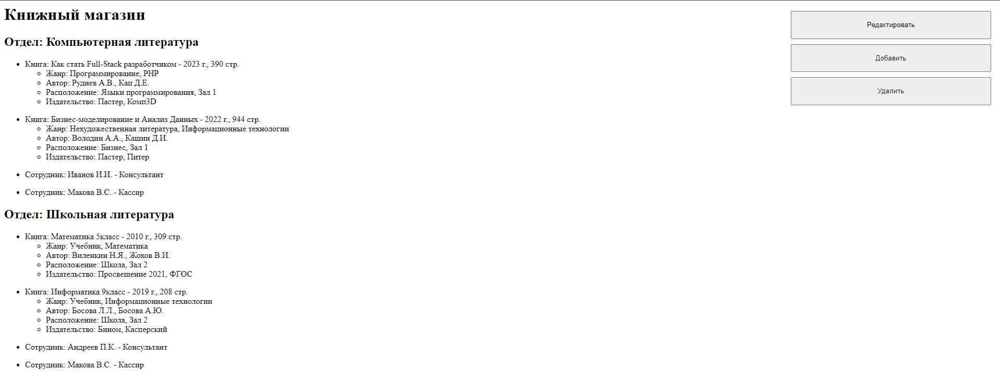
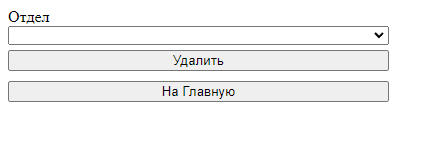
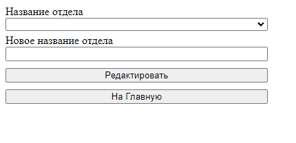

# Bookstore-SimpleXML_DOM

Работа с XML-файлом с помощью модуля DOM и расширения SimpleXML

Данная программа выводит информацию хранящуюся в файле XML

Предоставленны возможности добавления, удаления, редактирования информации:

---

*02/2023 - 06/2023*
